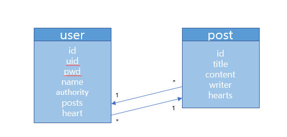

## 해야할 것

- [ ] 양방향 연관관계 정리
- [ ] jwt 로그인 및 로그아웃 구현
- [ ] 커스텀 예외처리하기 ex) jwt
- [ ] extends와 implements 차이 공부하기
- [ ] jwt 인증 구현
- [x] UserSession 이라는 클래스가 requestDto 일 때 인증이 필요함
- [ ] jwt 인증 Resolver가 아닌 Interceptor로 구현하기

### domain
- [ ] user - 회원 정보
- [ ] post - 게시글 정보

### controller

### service
- [ ] write - 글 작성
- [ ] read - 글 읽기

## 도전
- 좋아요 기능
- 게시글에 좋아요 받은 수 표시

## 엔티티 구조

